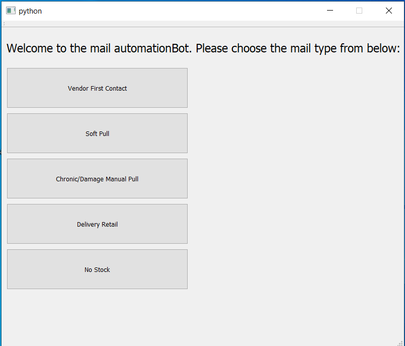
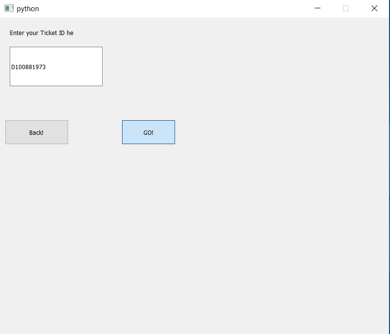
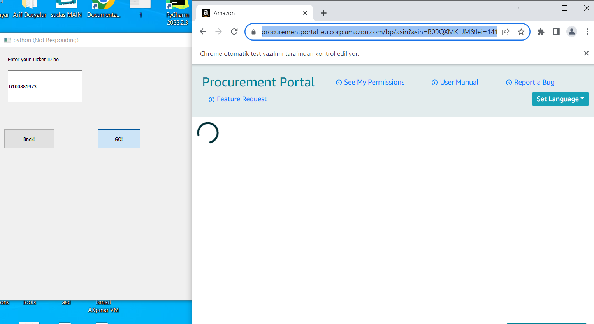
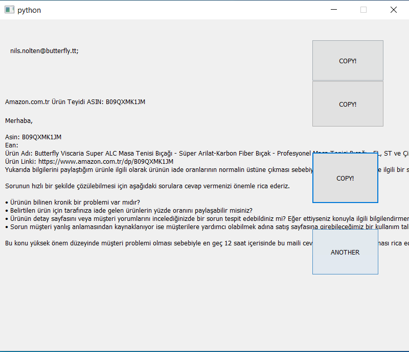

# mail_GUI 

Create mail blurbs with choosen blurb option and ticket ID. Ticket id is to find the correct vendor mail adress that is corresponding with the ticket's asin (product).

## Choose blurb

## Enter Ticket ID

## Automation opens a webdriver via Selenium framework collects neccesarry info from ticket, amazon web page, other amazon tools

## Blurb is ready click copy to have sections in your copy board, click another to go back to first step

